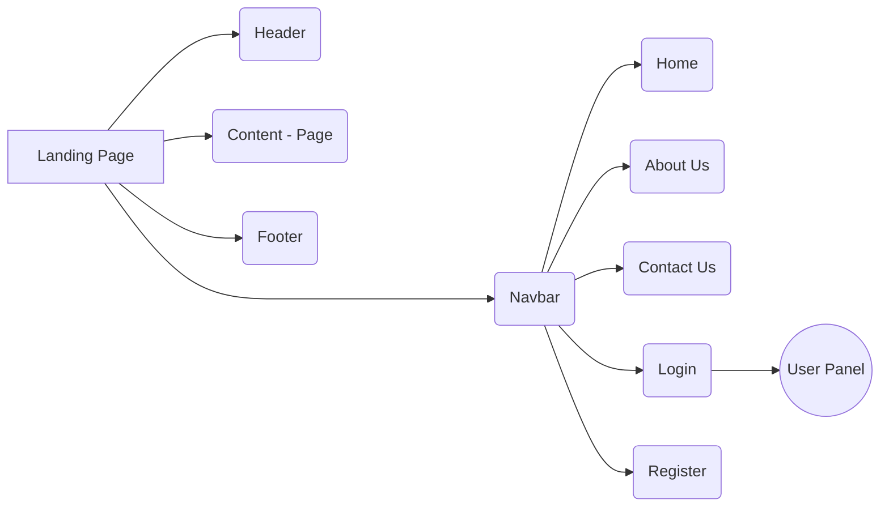
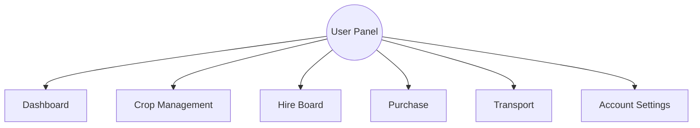

# Farmer Solutions 

## Project Overview

  

This project aims to develop a helpful web application for farmers. Farming is an essential occupation, but it comes with numerous challenges. Small farmers, in particular, face difficulties in various aspects of their work, such as transportation, hiring labor, and acquiring seeds and fertilizers. To address these challenges, we propose to create a user-friendly website tailored to the needs of farmers.

  

## Objectives

  

Our project's objectives are as follows:

  

- Provide farmers with a tool to simplify their daily tasks.

- Assist farmers in managing their crops, arranging transportation, hiring workers, and obtaining farming supplies.

- Facilitate connections between farmers and local as well as international markets.

- Foster community collaboration among farmers.

  

## Features

  

The website will offer the following features:

  

- Crop management system to help farmers keep track of their crops.

- Transportation booking system to assist farmers in arranging transportation for their produce.

- Job board for hiring workers and finding labor opportunities.

- Marketplace for purchasing seeds, fertilizers, and other farming necessities.

- Community forum for farmers to share knowledge, experiences, and resources.

  

## Goals

  

Our primary goals for this project are to:

  

- Enhance farming efficiency.

- Increase profitability for farmers.

- Foster connectivity and collaboration within the farming community.

  

## Conclusion

  

Through this project, we aim to support farmers in their crucial role of feeding communities and nations worldwide. By providing them with accessible tools and resources, we strive to make farming more efficient, profitable, and connected.

  

 Jai Jawan , Jai Kisan

  

# Flow of Website

  
  

  

## Description of website

  
  

  
## Description of Features
<!-- 
    This is a comment.
    You can use comments to provide additional context or notes in your Markdown file.
-->

# Farming Assistance Web Application Flow

## Landing Page

- Welcome message and introduction to the website.
- Overview of key features and benefits for farmers.
- Call-to-action buttons to sign up or log in.
## Header 

- It includes location of the Company
- Contact details & support e-mail
-  Social media icons for sharing and connecting with the community.
<!-- Authentication Section -->
## Authentication

- Sign-up form for new users to create an account.
- Log-in form for existing users to access their accounts.
- Password recovery option for forgotten passwords.

<!-- Dashboard Section -->
## Dashboard

- Personalized dashboard for logged-in users.
- Overview of current crops and their status.
- Quick access to transportation booking, hire board, and community forum.
- Graphs for previous sales, expenses, and fertilizer purchases for better analysis.
- Connect with others by linking to your favorite social media platforms.

<!-- Crop Management Section -->
## Crop Management

- Interface for adding, editing, and deleting crops.
- Fields to input details such as crop type, planting date, and expected harvest date.
- Visualization tools to track crop growth and yield projections.

<!-- Transportation Booking Section -->
## Transportation Booking

- Booking form for scheduling transportation of produce.
- Options to select pickup and delivery locations, date, and type of transport.
- Confirmation page with booking details and options to modify or cancel bookings.

<!-- Job Board Section -->
## Hire Board

- Listing of available job opportunities for farmers.
- Filters to narrow down job listings by location, type of work, and duration.
- Application submission form for interested users.

<!-- Profile Settings Section -->
## Profile Settings

- Account settings page for managing personal information and preferences.
- Options to update contact details, notification preferences, and password.
- Ability to view past orders, bookings, and activity history.

<!-- Footer Section -->
## Footer

- Links to important pages such as terms of service, privacy policy, and contact information.

